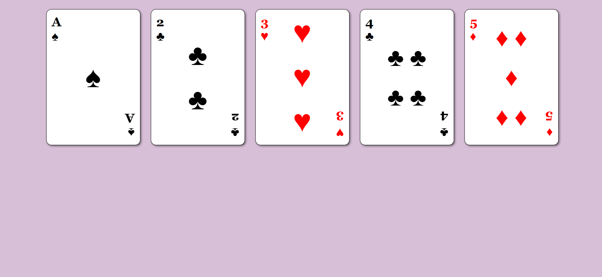

# 🃏 Playing Cards

A simple responsive webpage that displays a collection of playing cards using CSS Flexbox. This project was built as part of the **FreeCodeCamp Full Stack Developer Curriculum** to practice flexbox layout, alignment, spacing, and responsive design.

## 📸 Preview

## 🚀 Features

- Displays multiple playing cards using Flexbox
- Responsive layout with wrapping cards
- Horizontally centered card container
- Even spacing between cards
- Individual card layouts using nested flex containers
- Styled suits with black and red colors
- Rounded card corners and clean playing card design

- Creating flexible layouts with Flexbox
- Using `justify-content` for spacing elements
- Using `align-self` for individual item alignment
- Working with `flex-direction: column`
- Using `flex-wrap` for responsive layouts
- Creating reusable card components
- Structuring HTML for nested flex containers
