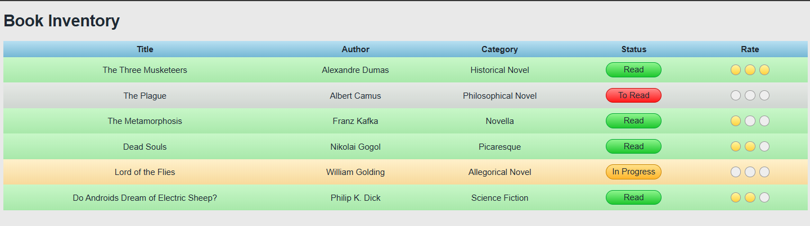

# Book Inventory App

## Preview

## Technical Highlights

- Built a structured book inventory using an HTML `table`.
- Used `thead`, `tbody`, `tr`, `th`, and `td` for semantic table organization.
- Used class-based selectors to style different reading statuses: **Read**, **To Read**, and **In Progress**.
- Used attribute selectors such as:
  - `[class="status"]`
  - `[class^="rate"]`
  - `[class~="one"]`
- Used `:first-child` and `:nth-child()` pseudo-classes to control the number of highlighted rating circles.
- Created circular rating indicators using `border-radius: 50%`.
- Used `linear-gradient()` to create gradient effects for table rows, headers, status badges, and ratings.
- Styled status labels as rounded badges using `border-radius`.
- Used `border-collapse: collapse` for a cleaner table layout.
- Used nested `span` elements to create the three-circle rating system.
