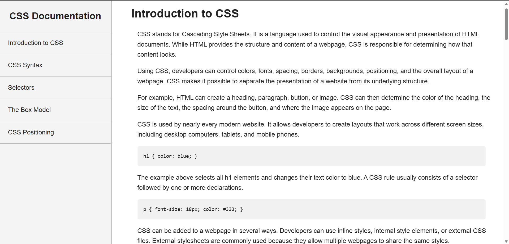

# CSS Documentation Page

## Preview

## Technical Highlights

- Created a fixed sidebar navigation using `position: fixed`.
- Used internal navigation links to jump to different documentation sections.
- Structured the content using semantic HTML elements such as `nav`, `main`, `section`, `header`, `p`, `code`, and `ul`.
- Used CSS selectors to style the navigation links and documentation sections.
- Added hover effects to navigation links for better user interaction.
- Styled code examples using a monospace font, padding, background color, and border radius.
- Used `box-sizing: border-box` to make element sizing more predictable.
- Implemented a responsive layout using a media query.
- On screens smaller than `768px`, the sidebar changes from a fixed vertical layout to a normal horizontal full-width section, while the main content adjusts accordingly.
