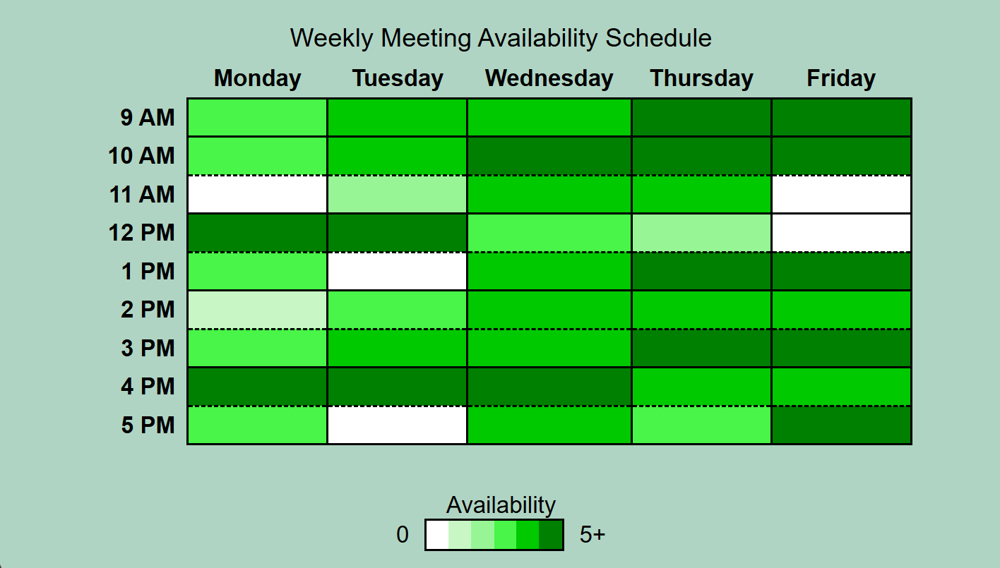

# Weekly Meeting Availability Schedule – Availability Table with CSS Gradients

## Preview

## Technical Highlights

- Used semantic HTML table elements such as `caption`, `thead`, `tbody`, `th`, and `td`.
- Used `scope="col"` and `scope="row"` to improve table accessibility.
- Used CSS custom properties to define reusable availability colors and border styles.
- Used classes such as `.available-0` through `.available-5` to represent different availability levels.
- Used alternating solid and dashed borders to visually separate schedule rows.
- Used `aria-label` attributes to provide meaningful availability information for table cells.
- Created the availability legend using Flexbox and a CSS linear gradient.
- Used `border-collapse` to create a clean table layout.