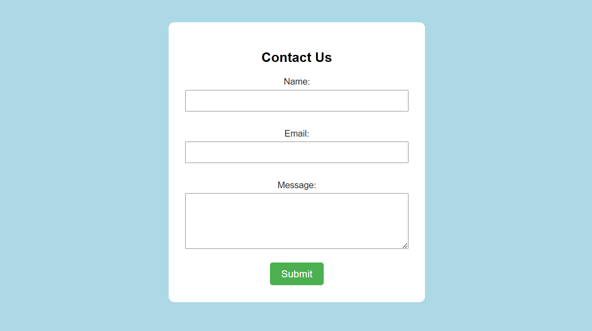

# Contact Form

A simple contact form built as part of the freeCodeCamp Responsive Web Design curriculum.

## Preview

## What I Learned

- Structuring a form inside a dedicated container element
- Creating a card-style layout using `padding`, `border-radius`, and background colors
- Applying consistent spacing between form elements
- Styling a clean and minimal contact form interface
