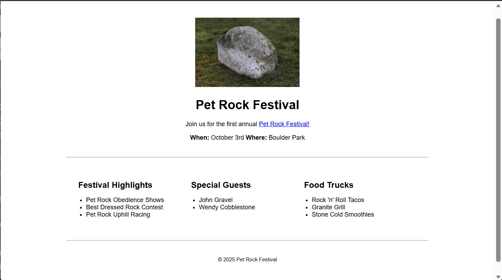

# Event Flyer Page

A simple event flyer page built as part of the freeCodeCamp Responsive Web Design curriculum.

## Preview

## What I Learned

- Semantic HTML elements
- CSS Flexbox
- Viewport units
- The CSS calc() function
