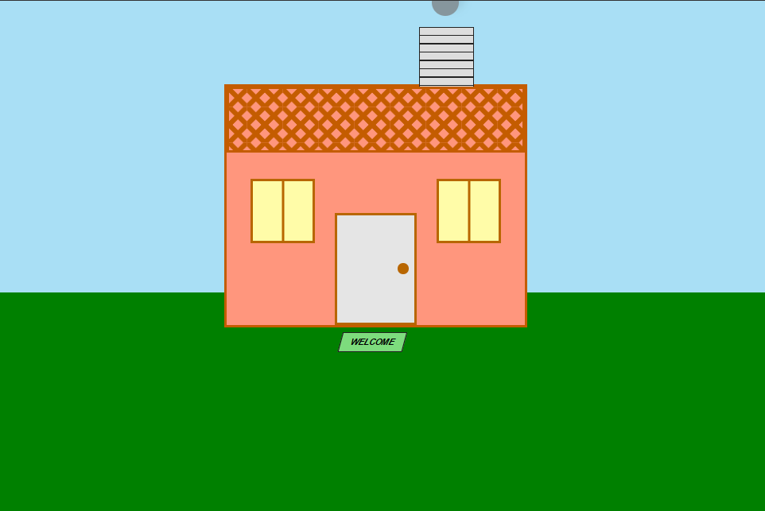

# House Painting

## Preview

## Technical Highlights

- Building a complete house illustration using only HTML and CSS
- Using `position: relative` on the house as the reference point for its absolutely positioned children
- Using `position: absolute` to precisely place the roof, chimney, windows, and door
- Creating the ground and decorative elements using `::before` and `::after` pseudo-elements
- Creating roof patterns with multiple `linear-gradient()` backgrounds
- Using `repeating-linear-gradient()` to create the horizontal lines on the chimney
- Using `box-shadow` to create a simple smoke effect
- Using `transform: skewX()` and `transform: translateX()` for positioning and styling
- Using `z-index` to control the stacking order of the house and ground
- Creating shapes and details with CSS borders, `border-radius`, and positioning
