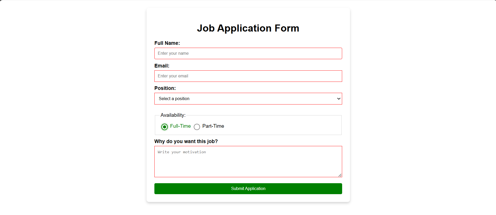

# Job Application Form

A job application form built as part of the freeCodeCamp Responsive Web Design curriculum.

## Preview

## What I Learned

- Creating structured HTML forms using inputs, select menus, radio buttons, textareas, and buttons
- Associating form controls with labels using the `for` and `id` attributes
- Using CSS pseudo-classes such as `:focus`, `:valid`, `:invalid`, `:checked`, `:hover`, and `:first-of-type`
- Using list selectors to apply the same styles to multiple elements
- Using attribute selectors to target specific input types
- Using the adjacent sibling combinator (`+`) to style a label associated with a checked radio button
- Creating custom radio buttons using `appearance: none`
- Using the `::before` pseudo-element to create a custom radio button indicator
- Using absolute positioning and CSS transforms to center elements
- Using `box-sizing: border-box` to include padding and borders within an element's specified width
- Creating responsive layouts using percentage widths and `max-width`
- Styling form elements with borders, spacing, shadows, and rounded corners
