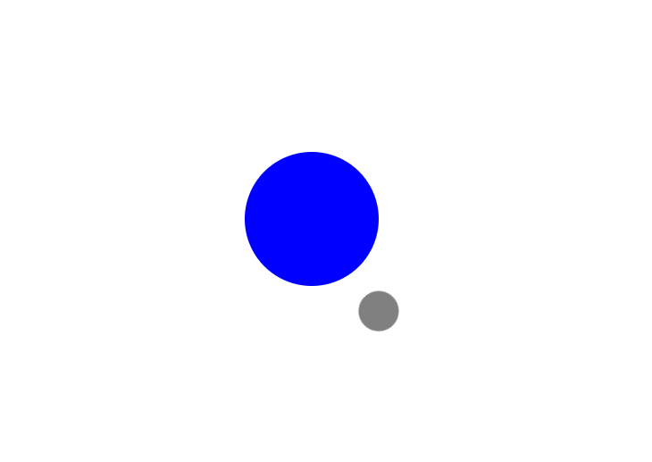

# Moon Orbit – CSS Animation and Orbital Positioning

[Live Demo](https://vishwanshv.github.io/freecodecamp-fullstack/responsive-web-design/labs/moon-orbit/)

## Preview

## Technical Highlights

- Built a simple Earth and Moon animation using only HTML and CSS.
- Used `position: relative` and `position: absolute` to establish and control the Earth, orbit, and Moon positions.
- Used `transform: translate(-50%, -50%)` to center the Earth and orbit around their reference points.
- Used `transform-origin` to keep the orbit's center fixed while it rotates.
- Used CSS `@keyframes` to animate the Moon's orbit continuously.
- Used `animation-duration`, `animation-timing-function`, and `animation-iteration-count` to create a smooth infinite rotation.
- Used viewport height (`vh`) and Flexbox to center the entire space system on the page.
- Used `border-radius: 50%` to create circular Earth and Moon shapes.
