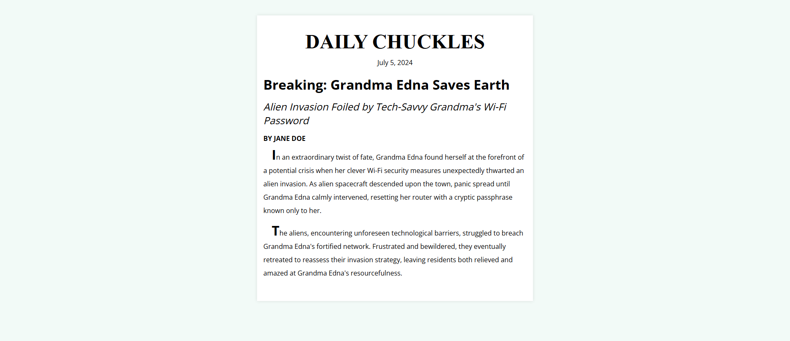

# Daily Chuckles Newspaper

A newspaper-style webpage built with HTML and CSS as part of the freeCodeCamp Responsive Web Design curriculum.

## Preview

## Technical Highlights

- Using `rem` and `em` units to create scalable typography
- Setting a custom root font size with the `html` selector
- Using different font families for the newspaper name and article content
- Styling text with `text-transform`, `font-style`, `font-weight`, and `letter-spacing`
- Creating newspaper-style paragraphs using `text-indent` and `line-height`
- Using the `::first-letter` pseudo-element to create a drop-cap effect
- Centering a fixed-width content container with `margin: auto`
- Creating a card-like newspaper layout using `max-width`, padding, and `box-shadow`
