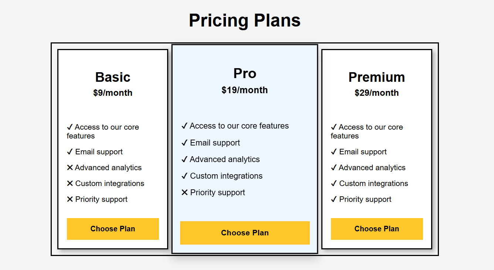

# Pricing Plans

A responsive pricing plans layout built as part of the freeCodeCamp Responsive Web Design curriculum.

## Preview

## What I Learned

- Creating responsive card layouts using Flexbox
- Using the `flex` shorthand property to control item sizing
- Using `flex-grow` to make selected flex items occupy additional space
- Reordering flex items with the `order` property
- Creating equal-height cards using Flexbox
- Applying hover animations with `transform` and `transition`
- Adding depth using `box-shadow`
- Using `gap` to create consistent spacing between flex items
