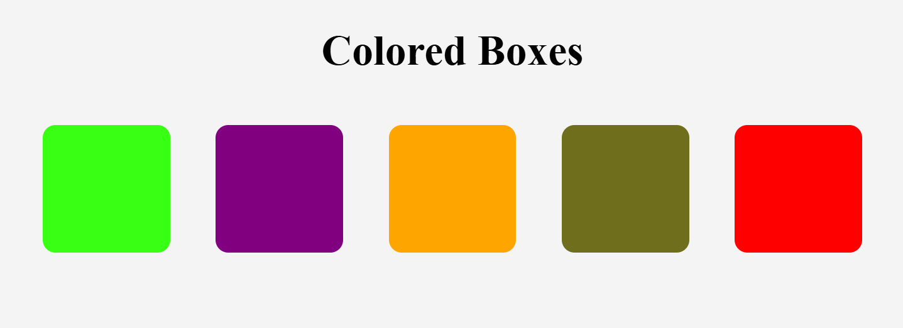

# 🎨 Colored Boxes

A simple web page built as part of the **Responsive Web Design** certification on **freeCodeCamp**. This project demonstrates different ways to apply colors in CSS by creating a row of colorful boxes.

## 📸 Preview

The page displays:

- A centered heading titled **"Colored Boxes"**
- Five colorful boxes arranged in a single row
- A light gray background
- Rounded corners on each box

## 🚀 Features

- Clean and minimal design
- Centered page layout
- Five colored boxes
- Demonstrates multiple CSS color formats:
  - Hexadecimal (`#39ff14`)
  - RGB (`rgb(128, 0, 128)`)
  - Named Color (`orange`)
  - HSL (`hsl(60, 60%, 27%)`)
  - Standard color (`red`)

## 📚 What I Learned

Through this project, I practiced:

- Structuring a webpage with HTML
- Linking an external CSS stylesheet
- Applying background colors
- Using different CSS color formats
- Setting element width and height
- Using `display: inline-block`
- Centering elements with `text-align`
- Adding spacing with `margin`
- Creating rounded corners using `border-radius`
