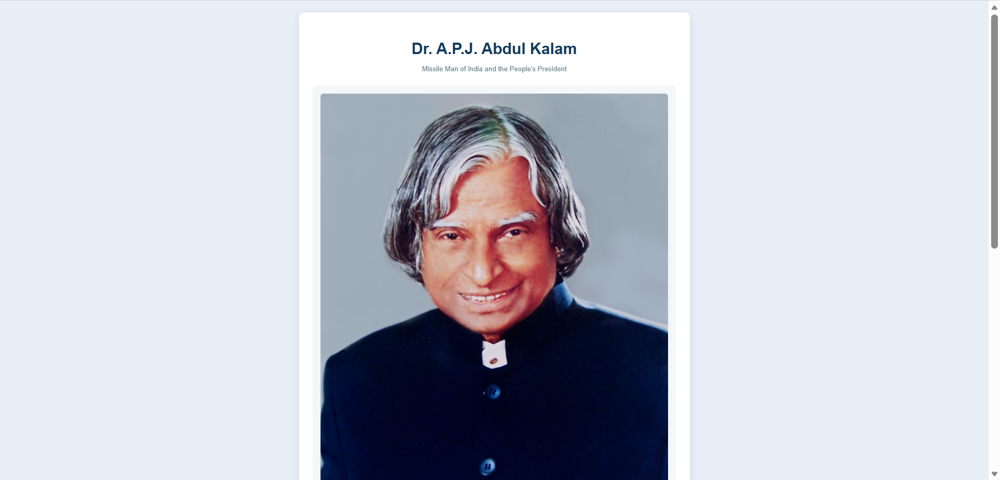

# Tribute to Dr. A.P.J. Abdul Kalam

## Preview

## Technical Highlights

- Structuring a tribute page using semantic HTML elements such as `header`, `main`, `figure`, `figcaption`, `section`, `blockquote`, and `footer`
- Using meaningful `id` attributes to satisfy accessibility and project requirements
- Creating a responsive layout with `max-width`, percentage-based sizing, and a media query
- Using `figure` and `figcaption` to semantically associate an image with its description
- Creating a styled quotation using `blockquote` and `border-left`
- Using `max-width: 100%` and `height: auto` to make images responsive
- Using CSS `@media` queries to adjust the layout for smaller screens
