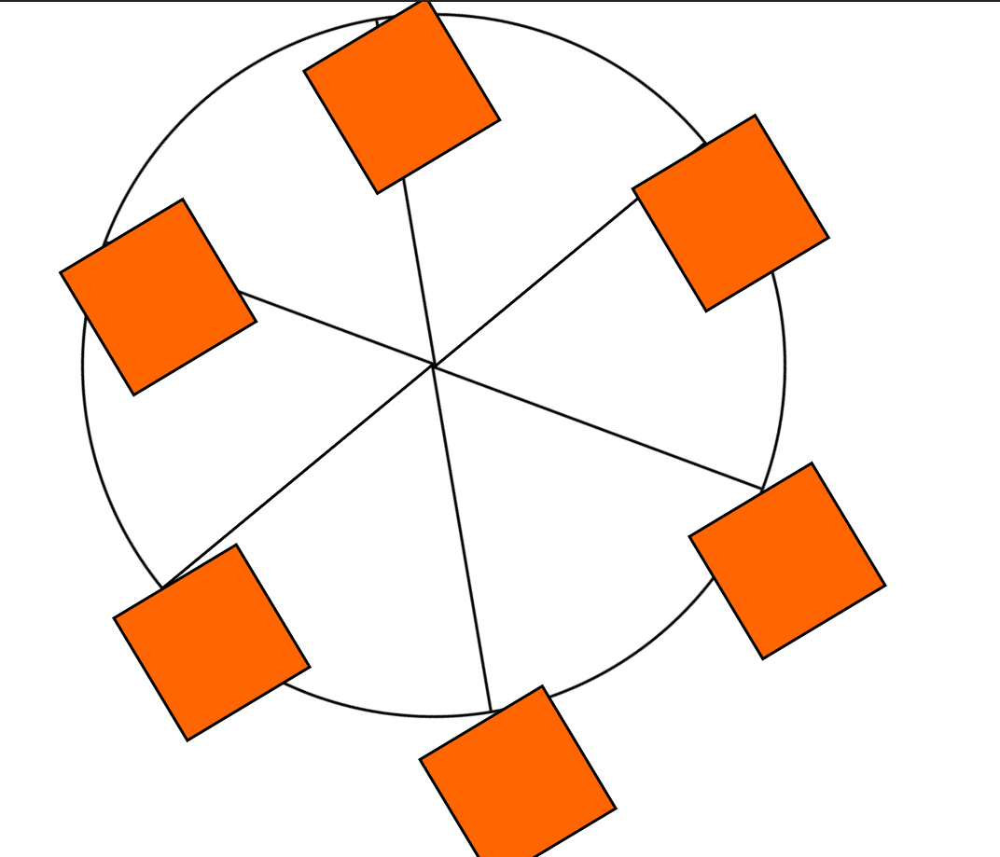

# Animated Ferris Wheel – CSS Animation and Positioning

[Live Demo](https://vishwanshv.github.io/freecodecamp-fullstack/responsive-web-design/workshops/animated-ferris-wheel/)

## Preview

## Technical Highlights

- Built a Ferris wheel illustration using only HTML and CSS.
- Used `position: absolute` to precisely position the wheel's spokes and cabins.
- Used `border-radius: 50%` to create the circular Ferris wheel.
- Used `transform-origin` to control the point around which the spokes and cabins rotate.
- Used `:nth-of-type()` selectors to rotate and position individual spokes and cabins.
- Used CSS `@keyframes` animations to continuously rotate the wheel.
- Used a separate `@keyframes` animation for the cabins, including rotation and changing background colors.
- Used `animation-iteration-count: infinite` and `animation-timing-function: linear` for continuous, smooth wheel rotation.
- Used viewport units (`vw`) together with `max-width` and `max-height` to make the wheel responsive while limiting its maximum size.
