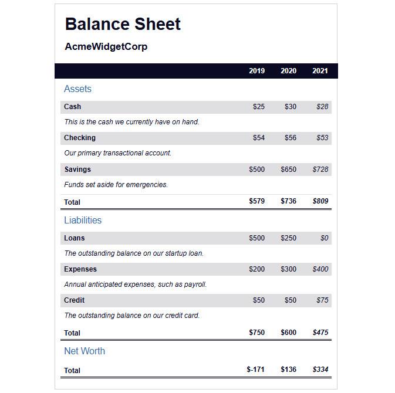

# Balance Sheet

A responsive balance sheet webpage

## Preview

## Technical Highlights

- Built a structured financial table using semantic HTML elements such as `table`, `caption`, `thead`, `tbody`, `th`, and `td`.
- Used multiple tables to display **Assets**, **Liabilities**, and **Net Worth**.
- Implemented a visually hidden `.sr-only` class to improve accessibility for screen readers.
- Used Flexbox to arrange the company name and **Balance Sheet** heading.
- Used `position: sticky` to keep the year header visible while scrolling.
- Used `z-index` to ensure the sticky header stays above other content.
- Used `calc()` to dynamically calculate column widths.
- Used `:first-of-type`, `:last-of-type`, and `:nth-of-type()` pseudo-classes for targeted styling.
- Used `:hover` to highlight total rows.
- Applied `linear-gradient()` to create row separators.
- Used `border-collapse` and double borders to create a clean financial table layout.
- Used absolute and relative positioning to correctly place table captions.
