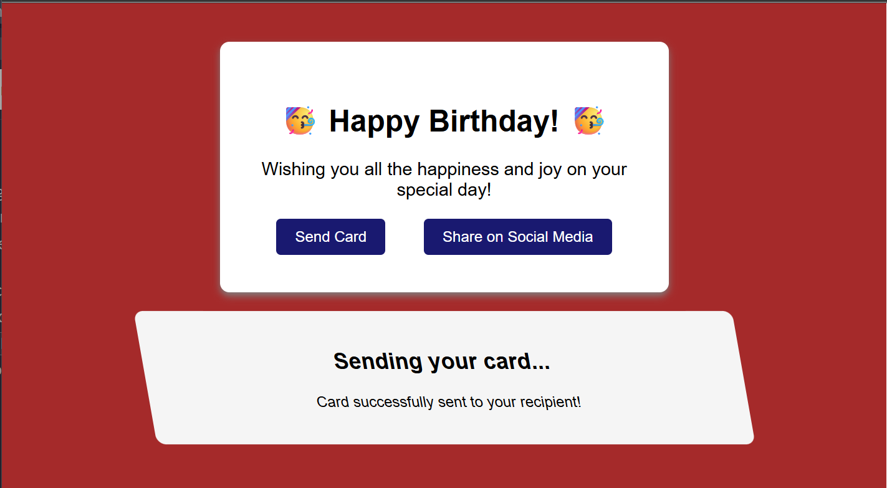

# Birthday Greeting Card

A greeting card webpage built as part of the freeCodeCamp Responsive Web Design curriculum.

## Preview

## What I Learned

- Using CSS pseudo-classes such as `:hover`, `:active`, `:focus`, `:visited`, and `:target`
- Using `::before` and `::after` pseudo-elements to add content
- Creating layouts with CSS Flexbox
- Adding transitions to create smooth visual changes
- Using CSS transformations such as `scale()` and `skewX()`
- Using `box-shadow` and `border-radius` to style elements
- Showing and hiding content using the `:target` pseudo-class
