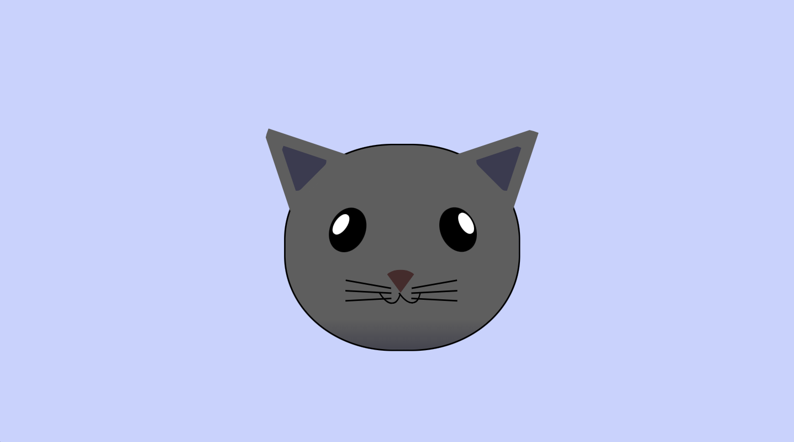

# Cat Painting

## Preview

## Technical Highlights

- Creating a complete illustration using only HTML and CSS
- Using `position: absolute` to precisely position individual facial features
- Using the positioned parent-child relationship to place elements relative to `.cat-head`
- Creating geometric shapes such as ears and the nose using CSS borders with transparent sides
- Using `border-radius` to create curved and organic shapes
- Using `transform: rotate()` to angle the ears, eyes, mouth, and whiskers
- Creating depth and color variation with `linear-gradient()`
- Using `z-index` to control the stacking order of overlapping elements
- Using nested elements to build complex shapes from simple CSS components
