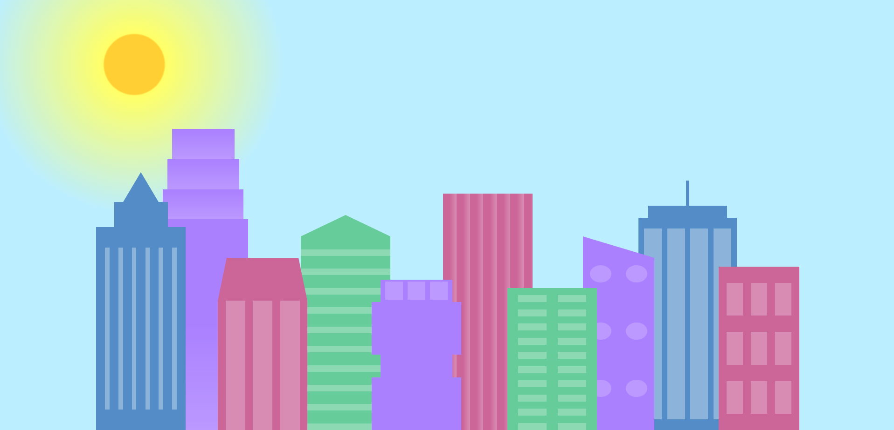
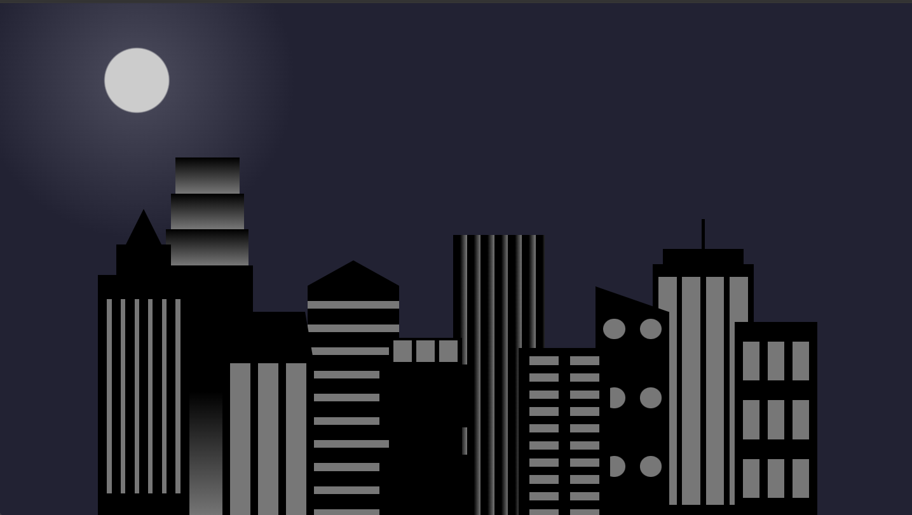

# City Skyline - Responsive CSS Cityscape Illustration

## Preview

## Technical Highlights

- Built a city skyline entirely with HTML and CSS using layered building elements.
- Used CSS custom properties (`--building-color`, `--window-color`) with `var()` to create reusable color values.
- Used Flexbox to arrange buildings horizontally and align them to the bottom of the viewport.
- Used nested Flexbox containers to arrange windows and building components.
- Created building and window patterns using `linear-gradient()` and `repeating-linear-gradient()`.
- Used multiple background gradients on a single element to create complex window patterns.
- Created triangular building tops using CSS borders with transparent sides.
- Used `vh`, `vw`, and percentage-based dimensions to make building sizes adapt to the viewport.
- Used `position: absolute` to layer the background and foreground buildings on top of each other.
- Used `position: relative` with `left` and `right` to adjust individual foreground buildings.
- Used a radial gradient to create the sky and sun effect.
- Used a media query to change the color scheme when the viewport width is `1000px` or smaller.
- Used CSS custom properties inside the media query to change multiple building and window colors at once.
