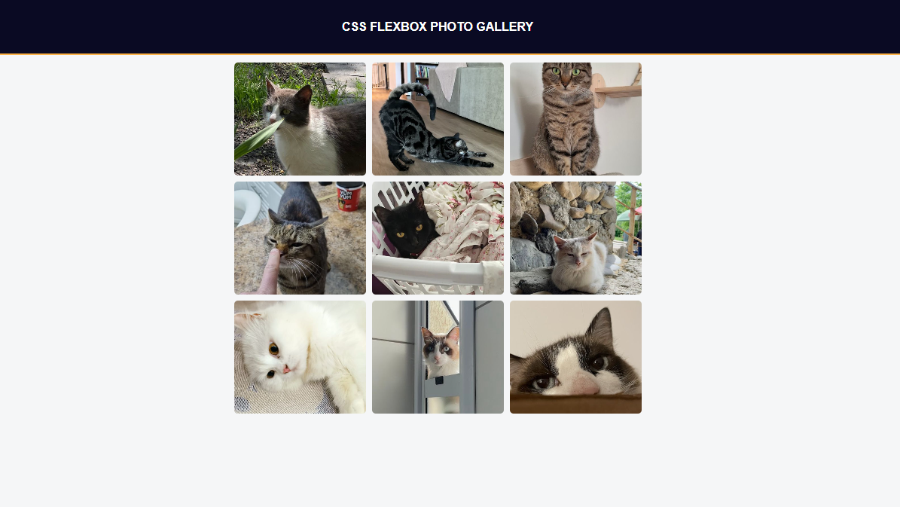

# CSS Flexbox Photo Gallery

A responsive photo gallery built as part of the freeCodeCamp Responsive Web Design curriculum.

## Preview

## What I Learned

- Building a responsive image gallery using Flexbox
- Using `flex-wrap` to automatically move items onto new rows
- Using the `gap` property to create consistent spacing between flex items
- Limiting container width with `max-width` while centering it using `margin: auto`
- Using `object-fit: cover` to crop images without distortion
- Creating responsive images with `width: 100%` and `max-width`
- Using the `::after` pseudo-element as a Flexbox spacing trick to improve the final row alignment