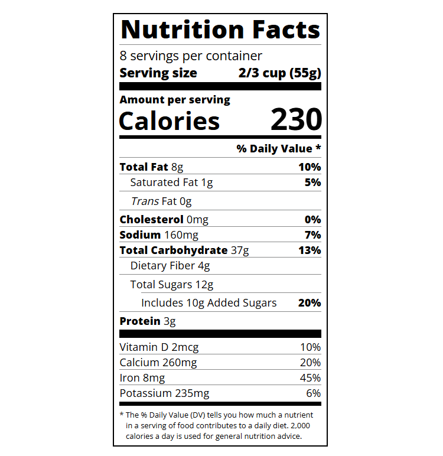

# Nutrition Label

A nutrition facts label recreated using HTML and CSS as part of the freeCodeCamp Responsive Web Design curriculum.

## Preview

## Technical Highlights

- Recreating a structured nutrition facts label using semantic HTML and nested elements
- Using Flexbox with `display: flex`, `justify-content`, and `align-items` for layout and alignment
- Using CSS classes to create reusable styles for dividers, indentation, and text formatting
- Using `:not()` to selectively style elements that do not have a particular class
- Using relative units such as `rem` and `em` for font sizing
- Using `text-indent` to create the hanging indentation for the nutrition label's note
- Creating different divider styles using borders, heights, and background colors
- Using negative margins for precise positioning and spacing
- Importing and applying the Open Sans font using Google Fonts
