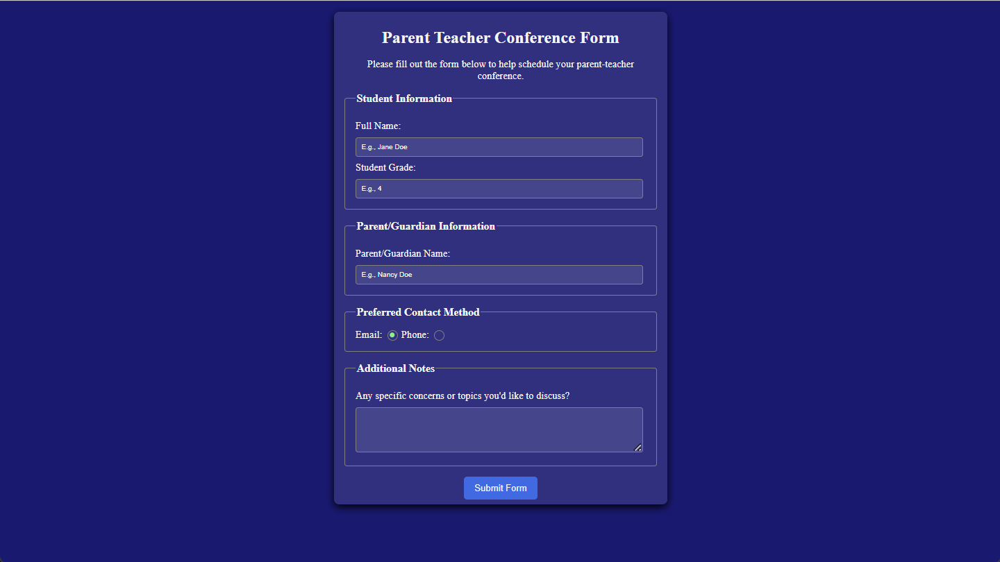

# Parent Teacher Conference Form

A parent-teacher conference form built as part of the freeCodeCamp Responsive Web Design curriculum.

## Preview

## What I Learned

- Creating structured and accessible forms using `form`, `fieldset`, `legend`, `label`, `input`, and `textarea` elements
- Using different input types such as text, number, and radio buttons
- Connecting labels to form controls using the `for` and `id` attributes
- Using the `required`, `placeholder`, and `checked` attributes
- Using CSS attribute and pseudo-class selectors such as `:not()` and `:checked`
- Customizing radio buttons using the `appearance` property
- Using the `::before` pseudo-element to create a custom radio button indicator
- Using CSS transforms and transitions to animate the selected radio button
- Using `rem` units for scalable font sizing
- Using transparent background colors with hexadecimal alpha values
- Styling forms with borders, spacing, shadows, and rounded corners
- Using the `:hover` pseudo-class and transitions to add interaction to buttons
