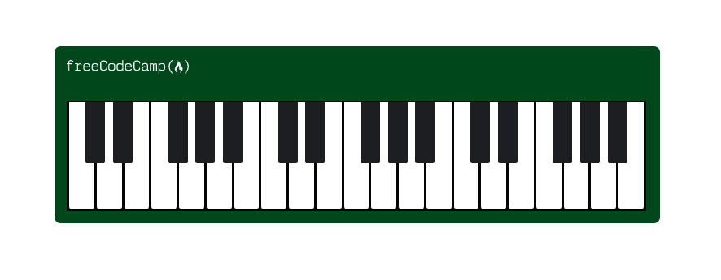

# Piano Design

## Preview

## Technical Highlights

- Built a piano interface using HTML and CSS.
- Created white piano keys using multiple `.key` elements.
- Created black keys using the `black--key` class and the `::after` pseudo-element.
- Used `position: relative` and `position: absolute` to correctly place the black keys and logo.
- Used `float: left` to arrange the piano keys horizontally.
- Used `overflow: hidden` to hide keys that extend beyond the visible keyboard area.
- Applied `border-radius` to create realistic rounded key edges and the piano body.
- Used the CSS `box-sizing` inheritance pattern:
- Used media queries to make the piano responsive across different screen sizes.
- Used `@media (max-width: 768px)` to adjust the piano, keyboard, and logo sizes for smaller mobile screens.
- Used `@media (max-width: 1199px) and (min-width: 769px)` to provide a different layout size for medium-sized screens such as tablets.
- The media queries ensure that the piano does not remain unnecessarily large on smaller viewports.
