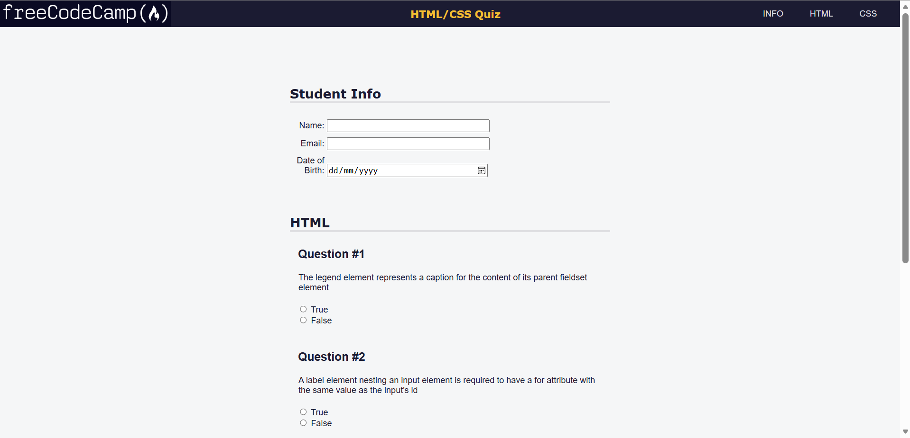
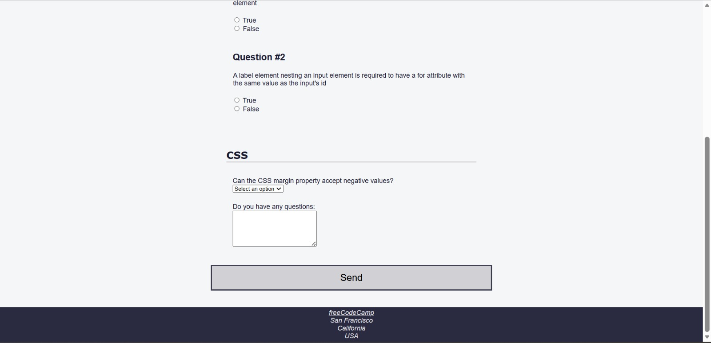

# Quiz WebPage

An accessible HTML/CSS quiz page built as part of the freeCodeCamp Responsive Web Design curriculum.

## Preview

## Technical Highlights

- Improving accessibility with ARIA attributes such as `role="region"` and `aria-labelledby`
- Creating screen-reader-only content with the `.sr-only` technique
- Using the `@media (prefers-reduced-motion: no-preference)` media query to respect users who prefer reduced motion
- Creating smooth navigation with `scroll-behavior: smooth`
- Using responsive CSS functions such as `max()`, `min()`, and `aspect-ratio`
- Using Flexbox to create the header and navigation layout
- Using CSS pseudo-elements with `::before` to add question labels without changing the HTML
- Creating responsive sizing with `vw`, `rem`, and percentage-based widths
