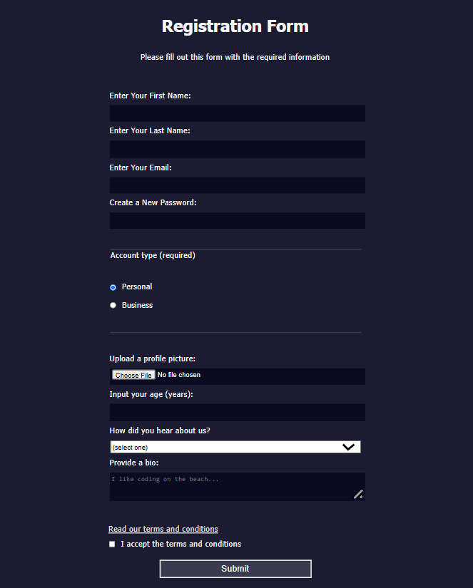

# Registration Form

A responsive registration form built as part of the freeCodeCamp Responsive Web Design curriculum.

## Preview

## What I Learned

- Building accessible HTML forms using `form`, `fieldset`, `legend`, and `label` elements
- Using a variety of form controls including text, email, password, number, file, radio buttons, checkboxes, select menus, and textareas
- Associating labels with form controls using the `for` and `id` attributes
- Using HTML validation attributes such as `required`, `min`, `max`, `pattern`, and `placeholder`
- Creating responsive layouts using viewport units (`vw`, `vh`) and `min-width`/`max-width`
- Styling form controls with CSS attribute selectors
- Using the `:last-of-type` pseudo-class to target the final fieldset
- Creating inline form elements using a reusable utility class
- Styling links, form controls, and buttons for a consistent user interface
- Using `display: block`, spacing, and width properties to create a clean, responsive form layout
