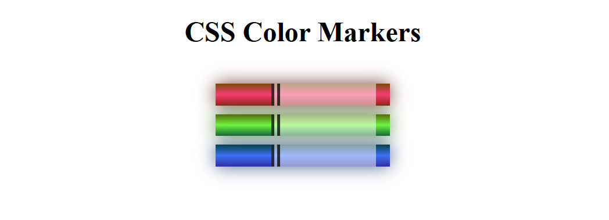

# CSS Color Markers

A simple CSS project built as part of the freeCodeCamp Responsive Web Design curriculum that recreates colored markers using only HTML and CSS.

## Preview

## What I Learned

- Creating layouts using nested `div` elements
- Using CSS classes to apply different styles to elements
- Centering elements using `margin: auto`
- Using `display: inline-block` to place elements side by side
- Creating realistic color effects using `linear-gradient()`
- Using different CSS color models including `rgb()`, `rgba()`, `hsl()`, and `hsla()`
- Applying transparency with alpha values
- Creating depth and glow effects using `box-shadow`
- Styling elements with borders, including the `double` border style
- Using shorthand CSS properties for cleaner and more maintainable code
