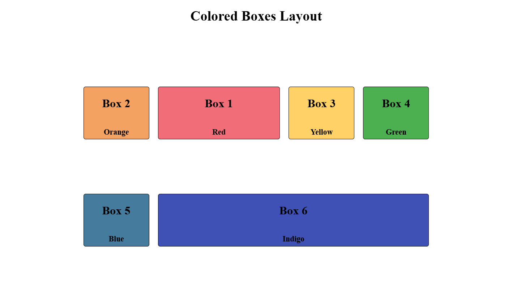

# Colored Boxes Layout

A Flexbox layout project built as part of the freeCodeCamp Responsive Web Design curriculum.

## Preview

## What I Learned

- Using the `flex` shorthand property (`flex-grow`, `flex-shrink`, and `flex-basis`)
- Reordering flex items using the `order` property
- Distributing extra space with `flex-grow`
- Controlling how items shrink using `flex-shrink`
- Arranging content inside each box using nested Flexbox
- Using `align-content` to distribute multiple rows of flex items
- Combining `flex-wrap` with responsive sizing to create a flexible layout
